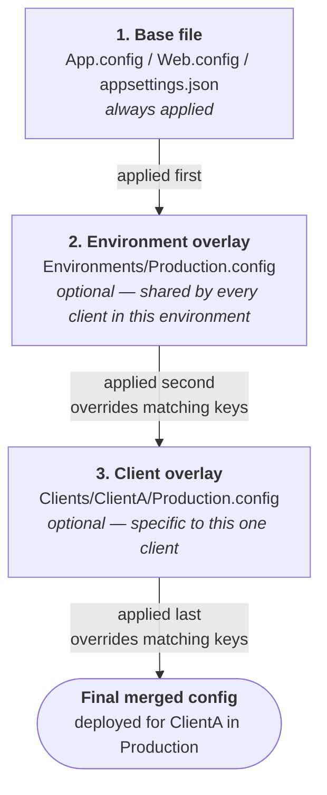
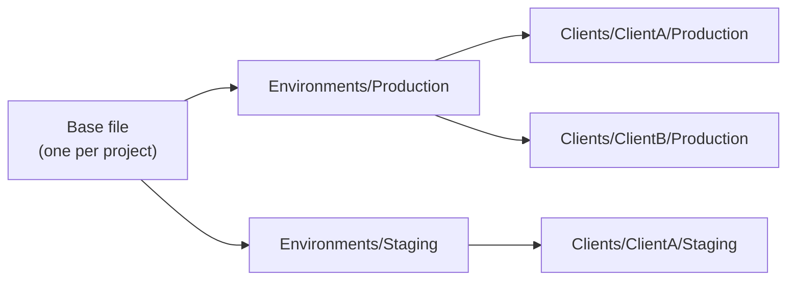

# Getting started

For people who just want to *use* this, not understand the whole architecture first. For the
full "why," see `CONFIG_MANAGEMENT.md`; this document only covers the "how" for everyday work.

## The shape of it, in one picture



This is not inheritance in the OOP sense — there's no class hierarchy, no declared reference
between layers. It's a fixed, three-step pipeline: whatever's in the base file is the starting
point, the environment overlay patches it if one exists, the client overlay patches the result
if one exists. A layer with nothing to override for a given key just leaves it alone. A missing
overlay file isn't an error — it just means that step is skipped.

**The bigger picture** — one base, many environments, many clients per environment, all sharing
that same base:



## Setting up a project from scratch

1. The project already has its base config file (`App.config`, `Web.config`, or
   `appsettings.json`) — nothing changes there.
2. Create `.configtransform/<ProjectName>/manifest.json`:
   ```json
   {
     "directory": "path/to/YourProject",
     "files": [
       { "relativeToDirectory": "App.config", "type": "xml" }
     ]
   }
   ```
   `directory` is just a path to the folder holding the config file — not a `.csproj`
   reference, despite the name of the field it used to be called. See `MANIFEST_SCHEMA.md`
   for what that actually means (including: this works for non-.NET projects too, as long as
   the config file itself is XML or JSON).
   (`type` is `"xml"` or `"json"` — see `MANIFEST_SCHEMA.md` for the full field reference.)
3. Create overlay folders **only when you actually need an override** — don't pre-create empty
   ones for every environment/client up front:
   ```
   .configtransform/<ProjectName>/App.config/
     Environments/
       Production.config
     Clients/
       ClientA/
         Production.config
   ```
4. Install the tool once per repo:
   ```bash
   dotnet new tool-manifest   # if the repo doesn't already have one
   dotnet tool install --local ConfigTransform.Xml --version <latest>
   dotnet tool install --local ConfigTransform.Json --version <latest>   # if you have JSON projects too
   ```
5. Preview before committing anything:
   ```bash
   dotnet tool run configtransform-xml -- \
     --manifest .configtransform/<ProjectName>/manifest.json \
     --client ClientA --environment Production --diff
   ```

That's the whole setup. No other configuration is needed.

## Day-to-day: adding a field

Three cases, depending on who needs the new value.

### 1. Same value for everyone (every client, every environment)

Just edit the base file directly. Nothing else to touch.

```xml
<!-- App.config -->
<add key="NewSetting" value="defaultValue" />
```
```json
// appsettings.json
{ "NewSetting": "defaultValue" }
```

### 2. Different per environment, same across clients within it

Add the key to the base file with a sensible default, then override it in
`Environments/<Env>.config`/`.json` for whichever environments need a different value.

```xml
<!-- base -->
<add key="LogLevel" value="Debug" />

<!-- Environments/Production.config -->
<add key="LogLevel" value="Warning" xdt:Transform="SetAttributes" xdt:Locator="Match(key)" />
```
```json
// base
{ "LogLevel": "Debug" }

// Environments/Production.json
{ "LogLevel": "Warning" }
```

### 3. Different per client

Same idea, one layer deeper — override in `Clients/<Client>/<Env>.config`/`.json`.

```xml
<!-- Clients/ClientA/Production.config -->
<add key="ApiUrl" value="https://clienta.example.com" xdt:Transform="SetAttributes" xdt:Locator="Match(key)" />
```
```json
// Clients/ClientA/Production.json
{ "ApiUrl": "https://clienta.example.com" }
```

### One real difference between XML and JSON when the key is brand new

- **JSON**: any layer can introduce a new key — it just appears in the merged result. No
  special syntax needed.
- **XML/XDT**: `SetAttributes` + `Locator="Match(key)"` requires the key to already exist in
  the document at that point — a `Locator` *matches* an existing element, it doesn't create
  one. So: **always add a genuinely new key to the base file first**, with a sensible default,
  then override it in whichever overlays need something different — exactly the pattern in
  cases 2 and 3 above. Only reach for `xdt:Transform="Insert"` (which adds a new element with
  no matching required) when a key should exist for one client only and nowhere else — an
  unusual, deliberate exception, not the default way to add a field.

## Should there be an `init` command?

Not yet — here's the reasoning, not just the answer:

- The manual setup above is small: one JSON file, plus folders created only when actually
  needed. There isn't much friction to automate away yet.
- No real solution repo has gone through this setup against real content yet (see
  `ROADMAP.md`'s "first real solution-repo pilot"). That pilot is worth doing *before* deciding
  what an `init` command should actually generate — building one now risks baking in
  assumptions (default folder names, file-type detection, what a "typical" manifest looks like)
  that might need to change once real usage is observed.
- It would also mean extending the CLI's argument model with a new mode alongside
  real-run/`--dry-run`/`--diff` — real added scope, not a small addition.

Revisit this once a few solution repos have gone through the manual steps above. If the exact
same steps get repeated identically every time with no real per-repo variation, that repetition
is the signal that automating it would actually earn its complexity. Premature right now.

Tracked as a future investigation, not just a passing note here — see `ROADMAP.md`'s "Later /
not yet scheduled" for the tracked item and its trigger condition.
