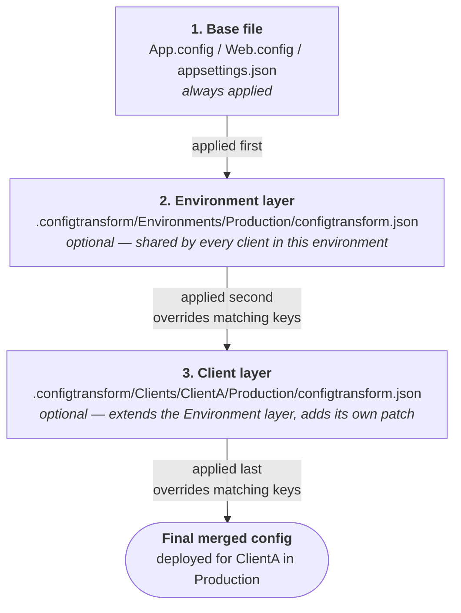
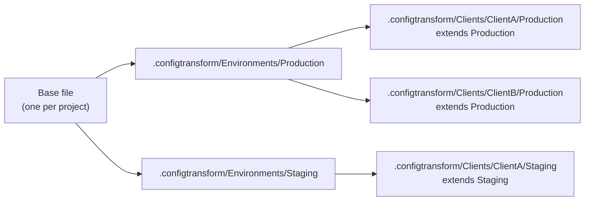

# Getting started

For people who just want to *use* this, not understand the whole architecture first. For the
full "why," see `CONFIG_MANAGEMENT.md`; for the field-by-field schema, see `MANIFEST_SCHEMA.md`;
this document only covers the "how" for everyday work.

## The shape of it, in one picture



This is not inheritance in the OOP sense, but unlike the tool's very first design, it *is* now an
explicit, declared reference between layers, not just a fixed rule baked into the tool: a Client
layer's own `configtransform.json` says `"extends": ".../Environments/Production/configtransform.json"`
directly. Each layer's `resources[]` entry pairs a project with its own optional `patch` — a layer
that doesn't list a project at all just leaves it alone; a missing `patch` file that *is* declared
is an error, but a project simply not mentioned isn't. See `MANIFEST_SCHEMA.md` for the full
schema and `docs/SELF_DESCRIBING_OVERLAYS_DESIGN.md` for why it's shaped this way.

**The bigger picture** — one base, many environments, many clients per environment, all sharing
that same base:



## Setting up a project from scratch

1. The project already has its base config file (`App.config`, `Web.config`, or
   `appsettings.json`) — nothing changes there. No manifest, no separate declaration file for the
   project itself: `resources[].path` (below) *is* the declaration, pointing straight at the real
   file.
2. Install the tool once per repo:
   ```bash
   dotnet new tool-manifest   # if the repo doesn't already have one
   dotnet tool install --local ConfigTransform.Cli --version <latest>
   ```
   One package covers both XML and JSON projects — `configtransform` dispatches each resource to
   the right merge engine by its own file extension, so there's nothing extra to install even if
   the repo has both. This package is published to a **private-by-default** GitHub Packages
   feed — the install above fails with a 401/403 until `nuget.config` and a `read:packages`
   credential are set up. See [`SECRETS_AND_LOCAL_SETUP.md`](SECRETS_AND_LOCAL_SETUP.md) §1 for
   the one-time setup (CI secret + `nuget.config` + local env vars, with Windows/macOS/Linux
   instructions) — do that first if this repo hasn't already.

   Once installed, `dotnet tool run configtransform` with no arguments at all (or
   `configtransform help`/`--help`/`-h` anytime) prints a quick tldr-style cheat sheet — worth
   running once just to confirm the install worked, before setting up a real override below.
3. Author the first override with `set` rather than hand-writing a `configtransform.json` and a
   patch file — it creates both, correctly, in one step:
   ```bash
   dotnet tool run configtransform -- set \
     --resource path/to/YourProject/App.config \
     --client ClientA --environment Production \
     --match ApiUrl --set https://clienta.example.com
   ```
   `--resource` is the project's own **repo-root-relative** path — not a separate manifest entry,
   not a `.csproj` reference, just the real file's path from the repo root. This one command:
   creates `.configtransform/Clients/ClientA/Production/configtransform.json` (with `extends`
   pointing at the matching Environment layer, even if that doesn't exist yet), authors
   `.configtransform/Clients/ClientA/Production/patch-<project>-App.config.xml`, and prints the
   effective diff. See `docs/FIELD_AUTHORING_DESIGN.md` for everything `set` can do, and `USAGE.md`
   for the full flag reference.
4. Preview before committing anything:
   ```bash
   dotnet tool run configtransform -- \
     --resource path/to/YourProject/App.config \
     --client ClientA --environment Production --diff
   ```
   Every flag above has a short form for less typing: `-r`/`-c`/`-e`. See `docs/USAGE.md` for the
   full flag reference, including omitting `--resource` entirely to process every resource a
   layer touches in one call.

That's the whole setup. No other configuration is needed.

## Day-to-day: adding a field

Three cases, depending on who needs the new value. All three can be done with `set` (recommended
— see step 3 above) or by hand-editing the relevant file directly; the hand-edited shape is shown
here since it's what `set` produces under the hood, and useful to recognize when reading a diff.

### 1. Same value for everyone (every client, every environment)

Just edit the base file directly. Nothing else to touch.

```xml
<!-- App.config -->
<add key="NewSetting" value="defaultValue" />
```
```json
// appsettings.json
{ "NewSetting": "defaultValue" }
```

### 2. Different per environment, same across clients within it

Add the key to the base file with a sensible default, then override it in the Environment layer's
own patch file (`.configtransform/Environments/<Env>/patch-<project-path-dashed>.<ext>`,
referenced from that layer's `configtransform.json`).

```xml
<!-- base -->
<add key="LogLevel" value="Debug" />

<!-- .configtransform/Environments/Production/patch-...xml -->
<add key="LogLevel" value="Warning" xdt:Transform="SetAttributes" xdt:Locator="Match(key)" />
```
```json
// base
{ "LogLevel": "Debug" }

// .configtransform/Environments/Production/patch-....json
{ "LogLevel": "Warning" }
```

### 3. Different per client

Same idea, one layer deeper — override in the Client layer's own patch file
(`.configtransform/Clients/<Client>/<Env>/patch-<project-path-dashed>.<ext>`).

```xml
<!-- .configtransform/Clients/ClientA/Production/patch-...xml -->
<add key="ApiUrl" value="https://clienta.example.com" xdt:Transform="SetAttributes" xdt:Locator="Match(key)" />
```
```json
// .configtransform/Clients/ClientA/Production/patch-....json
{ "ApiUrl": "https://clienta.example.com" }
```

### One real difference between XML and JSON when the key is brand new

- **JSON**: any layer can introduce a new key — it just appears in the merged result. No
  special syntax needed.
- **XML/XDT**: `SetAttributes` + `Locator="Match(key)"` requires the key to already exist in
  the document at that point — a `Locator` *matches* an existing element, it doesn't create
  one. So: **always add a genuinely new key to the base file first**, with a sensible default,
  then override it in whichever layers need something different — exactly the pattern in
  cases 2 and 3 above. Only reach for `xdt:Transform="Insert"` (which adds a new element with
  no matching required) when a key should exist for one client only and nowhere else — an
  unusual, deliberate exception, not the default way to add a field.

## Should there be an `init` command?

Not yet — here's the reasoning, not just the answer:

- `set` already covers the friction an `init` command would have targeted: it creates a missing
  `configtransform.json` (with the right `extends`) and authors the patch file in one step, for
  the actual common case of "I need to override one field."
- No real solution repo has gone through this setup against real content yet (see
  `ROADMAP.md`'s "first real solution-repo pilot"). That pilot is worth doing *before* deciding
  what an `init` command should actually generate — building one now risks baking in
  assumptions (default folder names, file-type detection, what a "typical" tree looks like)
  that might need to change once real usage is observed.
- It would also mean extending the CLI's argument model with a new mode alongside
  real-run/`--dry-run`/`--diff`/`set`/`--list` — real added scope, not a small addition.

Revisit this once a few solution repos have gone through the manual steps above. If the exact
same steps get repeated identically every time with no real per-repo variation, that repetition
is the signal that automating it would actually earn its complexity. Premature right now.

Tracked as a future investigation, not just a passing note here — see `ROADMAP.md`'s "Later /
not yet scheduled" for the tracked item and its trigger condition.
